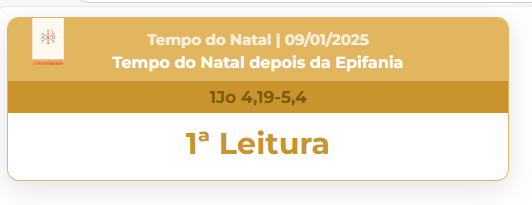
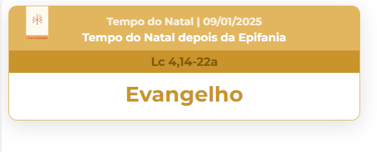
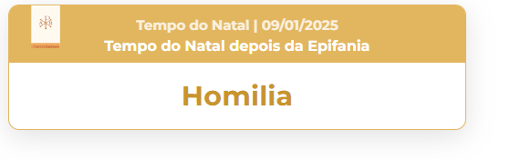
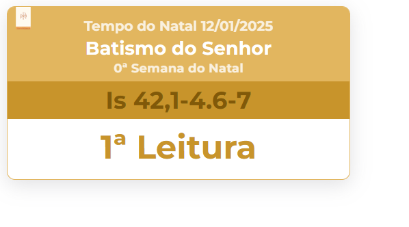
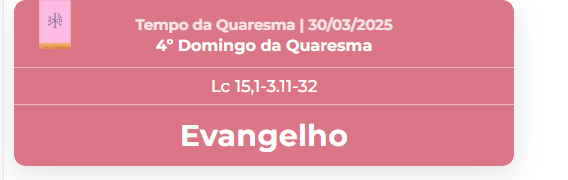
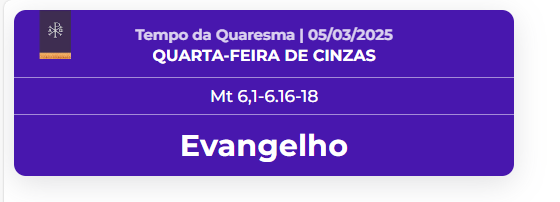
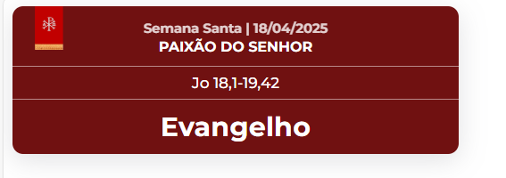

# OBS Liturgia Cards

Uma aplicação em Node.js e EJS para criar **cards de legendas para OBS** voltados à Santa Missa. O sistema gera automaticamente cards para as leituras, salmo, evangelho, homilia e informações litúrgicas, facilitando transmissões online com qualidade e organização.

## **Funcionalidades**

- Geração automática de cards para:
  - 1ª Leitura
  - 2ª Leitura (apenas em missas dominicais)
  - Evangelho
  - Salmo Responsorial
  - Homilia
- Exibição da **cor litúrgica** correspondente ao tempo litúrgico.
- Indicação do **tempo litúrgico** e referência da leitura (ex.: "Carta de São Paulo aos Romanos 8, 28-30").
- **Regras litúrgicas incorporadas**:
  - Não exibe segunda leitura se não for missa dominical.
  - Missa da noite no sábado usa a liturgia do dia seguinte (dominical).
- Cards otimizados para OBS, prontos para exibição em streaming.

## **Tecnologias Utilizadas**

- Node.js
- [Express.js](https://expressjs.com/) (caso use servidor)
- Manipulação de arquivos JSON ou base de dados local
- Templates para OBS (HTML/CSS, caso use browser source)

## **Como usar**

1. Clone o repositório:
```bash
git clone https://github.com/seuusuario/obs-liturgia-cards.git
````

2. Instale as dependências:

```bash
npm install
```

3. Execute o aplicativo:

```bash
node index.js
```

4. Os cards gerados podem ser adicionados como **Browser Source** no OBS.

## **Exemplos de Cards**

 







## **Contribuição**

Contribuições são bem-vindas!
Sinta-se à vontade para abrir **issues** ou **pull requests**.

## **Licença**

[MIT](LICENSE)
